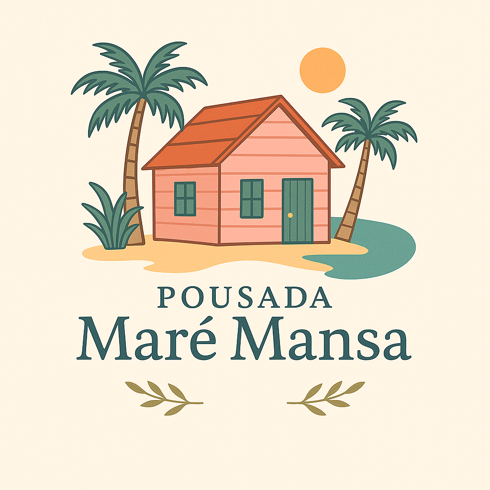

# 🏨 Pousada Maré Mansa

Sistema de gerenciamento para uma pousada, desenvolvido com **Python**, **Tkinter** e **SQLite**, utilizando a arquitetura **MVC**.

---

## 📌 Visão Geral

A aplicação desktop tem como objetivo facilitar a administração de uma pousada, permitindo:

- Gerenciamento de hóspedes  
- Controle de agendamentos  
- Alocação de quartos  
- Geração de relatórios  
- Registro de atividades (logs)

---

## 🧩 Funcionalidades

| Módulo         | Descrição                                                                 |
|----------------|---------------------------------------------------------------------------|
| 🔐 Login       | Autenticação de usuários                                                  |
| 📋 Menu        | Navegação entre as funcionalidades principais                             |
| 👤 Clientes     | Cadastro automático pelo CPF durante o agendamento                       |
| 📅 Agendamentos| CRUD de reservas com validações de datas e disponibilidade de quartos     |
| 🛏️ Quartos     | Controle de disponibilidade dos quartos                                   |
| 📈 Relatórios   | Visualização de logs administrativos                                      |

---

## ✅ Validações e Regras de Negócio

- Todos os campos obrigatórios são validados  
- Datas devem ser coerentes (entrada < saída)  
- A data de entrada e saída não pode ser anterior à data atual  
- Quarto deve estar disponível no momento do agendamento  
- CPF único por cliente  
- Cliente é cadastrado automaticamente, se não existir  

---

## 🧱 Arquitetura MVC

O projeto segue o padrão **Model-View-Controller**, garantindo clareza, organização e manutenção facilitada.

### 🔹 Model

- Contém a lógica de negócio e persistência dos dados  
- Usa `@dataclass` para estruturação clara  
- Ex.: `Cliente`, `Quarto`, `Agendamento`

### 🔹 Controller

- Intermedia as interações entre View e Model  
- Valida dados e chama os métodos apropriados  
- Métodos estáticos para operações com SQLite  
- Ex.: `control_cliente.py`, `control_quarto.py`

### 🔹 View

- Interface gráfica com **Tkinter**  
- Layout compacto e padronizado (350x300)  
- Usa `Entry`, `Combobox`, `DateEntry`, `MessageBox`  
- Ex.: `TelaLogin`, `FormsAgendamento`, `TelaMenuPrincipal`

---

## 🛠️ Tecnologias Utilizadas

- **Python 3.6+**  
- **Tkinter** — GUI  
- **tkcalendar** — Seleção de datas  
- **Pillow** — Manipulação de imagens (ícones e logos)  
- **SQLite** — Banco de dados local  
- **Dataclasses** — Organização dos modelos

---

## 📁 Estrutura de Pastas

```bash
pousada_mare_mansa/
│
├── controllers/       # Lógica intermediária (Controller)
├── model/             # Modelos de dados e regras de negócio (Model)
├── views/             # Interface gráfica (View)
├── main.py            # Arquivo principal de execução
├── LICENSE            # Arquivo de leitura sobre a licença MIT
└── README.md          # Documentação do projeto
```

---

## 🚀 Como Executar o Projeto

### 1. Clone ou baixe este repositório

```bash
gh repo clone gbmoraisc/Pousada-Mare-Mansa

cd pousada_mare_mansa
```

### 2. Crie um ambiente virtual

```bash
python -m venv .venv
```

### 3. Ative o ambiente virtual

- **Windows:**

```bash
.venv\Scripts\activate
```

- **Linux/macOS:**

```bash
source .venv/bin/activate
```

### 4. Instale as dependências

```bash
pip install tkcalendar Pillow
```

### 5. Execute a aplicação

```bash
python main.py
```

---

## 📄 Licença

Projeto criado para fins educacionais. Sinta-se livre para utilizar e modificar conforme necessário.

*Fique à vontade para abrir issues, enviar pull requests ou apenas compartilhar ideias!
*

---

# 🏁 Considerações Finais

Projeto criado para fins educacionais. Sinta-se livre para utilizar e modificar conforme necessário.

> 🌊 Preparado para entrar na Pousada Maré Mansa ?
